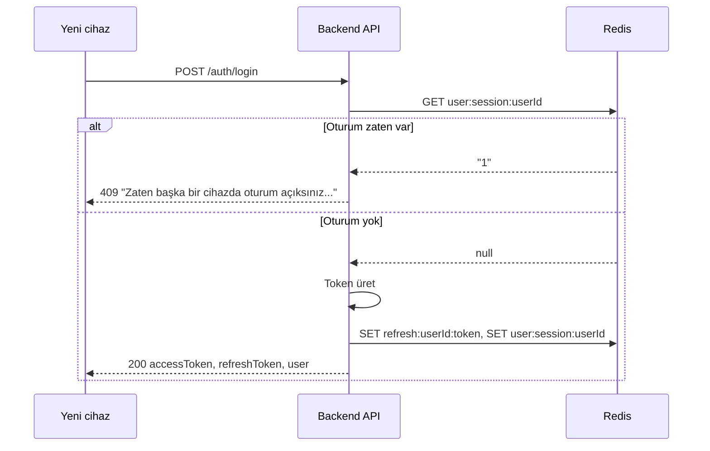

# Aynı anda tek cihazda giriş (single-session) planı

## Mevcut durum

- [backend/src/modules/auth/auth.service.ts](backend/src/modules/auth/auth.service.ts): Login sonrası refresh token `refresh:${userId}:${token}` ile Redis’e yazılıyor. Her yeni login yeni bir token ekliyor; aynı kullanıcının birden fazla cihazda eşzamanlı oturumu mümkün.
- Logout sadece gönderilen refresh token’ın key’ini siliyor; “kullanıcının tek oturumu” kavramı yok.

## Hedef davranış

- Kullanıcı **zaten aktif oturuma sahipken** (başka bir cihazda giriş yapmışken) **yeni bir cihazdan login denemesi** kabul edilmeyecek.
- İstemciye anlamlı bir hata kodu ve mesaj dönülecek (örn. 409 + Türkçe mesaj).
- Mevcut cihazdan logout yapıldığında aynı kullanıcı tekrar (herhangi bir cihazdan) login olabilecek.

## Teknik yaklaşım

Redis’te kullanıcı başına “aktif oturum var mı?” bilgisini tutacağız. Böylece login’de “zaten oturum var mı?” kontrolü yapıp varsa yeni token üretmeyip isteği reddedeceğiz.

- **Yeni key:** `user:session:${userId}`
  - Değer: `"1"` (veya sabit bir değer)
  - TTL: Refresh token süresi ile aynı (`REFRESH_TOKEN_TTL_SECONDS` = 7 gün)
  - Anlamı: Bu kullanıcı için şu an geçerli bir oturum var.

Davranış kuralları:

1. **Login**

- `redis.get("user:session:" + userId)` dolu ise → **409 Conflict** dön: _"Zaten başka bir cihazda oturum açıksınız. Giriş yapmak için önce o cihazdan çıkış yapın."_
- Dolu değilse: mevcut akış (access + refresh token üret, `refresh:${userId}:${token}` key’ini set et), **ayrıca** `user:session:${userId}` key’ini set et (TTL = 7 gün).

1. **Refresh**

- Mevcut refresh akışı aynı kalacak (token rotate). Ek olarak oturumun devam ettiğini işaretlemek için `user:session:${userId}` key’ini yeniden set et (TTL = 7 gün). Böylece kullanıcı aktif kaldığı sürece “tek oturum” kilidi sürer.

1. **Logout**

- Mevcut: `refresh:${userId}:${token}` key’i siliniyor.
- Ek: `user:session:${userId}` key’i de silinecek. Böylece kullanıcı tekrar login olabilir.

## Değiştirilecek dosyalar

| Dosya                                                                                           | Değişiklik                                                                                                                                                                                                                                         |
| ----------------------------------------------------------------------------------------------- | -------------------------------------------------------------------------------------------------------------------------------------------------------------------------------------------------------------------------------------------------- |
| [backend/src/modules/auth/auth.service.ts](backend/src/modules/auth/auth.service.ts)            | `login`: Önce `user:session:${userId}` kontrolü; varsa 409 at. Token’ları yazdıktan sonra `user:session:${userId}` set et. `refresh`: Token rotate’ten sonra `user:session:${userId}` set et (TTL yenile). `logout`: `user:session:${userId}` sil. |
| [backend/src/middleware/errorHandler.ts](backend/src/middleware/errorHandler.ts) veya uygun yer | 409 için HTTP status ve mesajın istemciye doğru dönüldüğünden emin ol (zaten varsa dokunulmayabilir).                                                                                                                                              |

## Sabitler

- Session key: `user:session:${userId}`
- Hata kodu: **409 Conflict**
- Mesaj (örnek): `"Zaten başka bir cihazda oturum açıksınız. Giriş yapmak için önce o cihazdan çıkış yapın."`

## İsteğe bağlı (bu planın dışında)

- İleride “diğer cihazdaki oturumu kapat ve bu cihazda giriş yap” (single session, son giriş kazanır) istenirse: login’de 409 yerine mevcut `user:session` + ilgili `refresh:*` key’ini silip yeni oturum açılacak şekilde genişletilebilir. Şu anki talebe göre **reddetmek** yeterli.

## Özet akış

